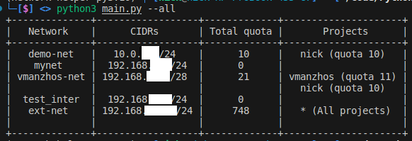

# Openstack Network Helper
Выводит информацию о сети OpenStack, учитывая квоту на ВМ по проектам 
Если в системе есть openstack-cli и python3, то зависимости устанавливать не нужно

## Установка
```bash
poetry install (or pip3 install -r requirements.txt)
cp main.py /opt/os-nethelper.py
link /opt/os-nethelper.py /bin/os-nethelper
chmod +x /bin/os-nethelper
```

```bash
$ os-nethelper --help
$ os-nethelper --all
```

## Скриншоты
